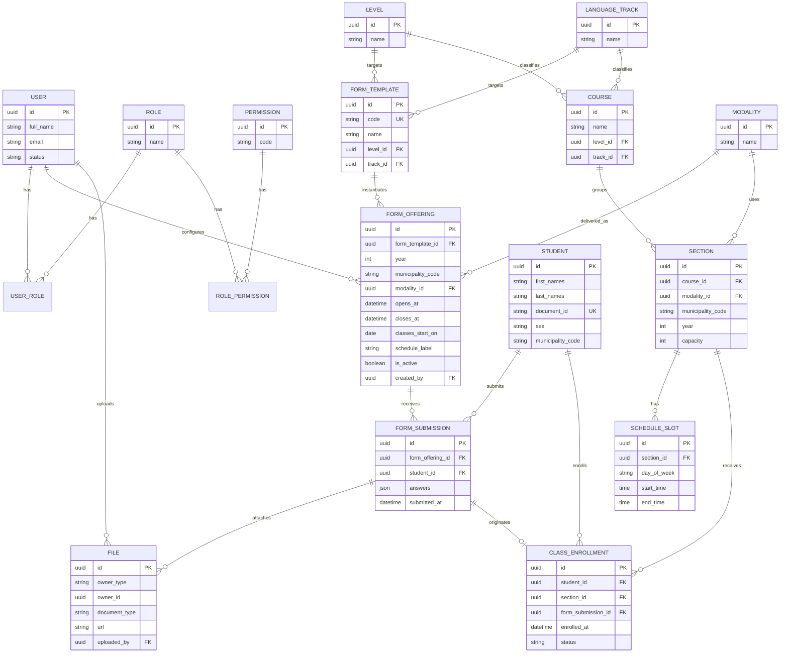

# Diagrama entidad-relación

Modelo de datos propuesto para la gestión de usuarios, formularios de inscripción y asignación de secciones.

Refleja las decisiones tomadas en [`specs/005-enrollment-forms/spec.md`](../../specs/005-enrollment-forms/spec.md);
los cambios respecto del borrador inicial están anotados al final.

## Decisiones reflejadas

- **La modalidad pertenece a la convocatoria, no a la plantilla.** `FORM_TEMPLATE.modality_id` se eliminó y
  `FORM_OFFERING.modality_id` ocupa su lugar. Así se mantienen seis plantillas (L1/L2 × principiante, intermedio,
  avanzado) y el grupo virtual y el presencial de un mismo curso son dos convocatorias de la misma plantilla.
- **`FORM_TEMPLATE.code` es la clave estable** que enlaza cada fila con la definición quemada en el código
  (`l2-avanzado`, `l1-principiante`, …). Es única y no cambia entre entornos ni entre años.
- **La convocatoria carga la información del curso** que se muestra a quien se inscribe: `classes_start_on` y
  `schedule_label`, además de la ventana `opens_at`/`closes_at`, interpretada en hora de Guatemala.
- **`STUDENT` pierde `birth_date`.** El formulario pregunta rango de edad, no fecha de nacimiento; el rango vive
  en `FORM_SUBMISSION.answers` y es lo que alimenta los reportes de edad.
- **`STUDENT.document_id` es único**: el DPI identifica a la persona y es lo que permite reutilizar el
  expediente entre convocatorias en lugar de duplicarlo.
- **`FORM_SUBMISSION` es única por `(form_offering_id, student_id)`**: esa restricción es la que impide el
  segundo envío del mismo documento a la misma convocatoria.
- **`FILE` gana `document_type`** (copia del DPI, carta de compromisos, ficha de inscripción, constancia de nivel
  principiante, constancia de nivel intermedio) y se relaciona con `FORM_SUBMISSION` por el par polimórfico
  `owner_type`/`owner_id`. `uploaded_by` queda vacío cuando el archivo llega desde el formulario público.
- **El catálogo geográfico no es una tabla.** Departamentos, municipios y zonas viven como
  constante en `src/modules/geography/domain/guatemala.ts`. Quien ubica algo guarda el código INE
  del municipio (`municipality_code`, cuatro dígitos: los dos primeros son el departamento).

## Correspondencia física

El diagrama es conceptual. Dos entidades no se traducen a tablas una por una — decidido en
[`specs/005-enrollment-forms/research.md`](../../specs/005-enrollment-forms/research.md) (D3, D7):

- **`LEVEL`, `LANGUAGE_TRACK` y `MODALITY` son enums de Prisma**, no tablas; el catálogo
  geográfico no llega siquiera a existir en la base. Su contenido es
  cerrado, lo conoce el código —las seis plantillas están quemadas— y nadie los administra desde
  la interfaz. Los catálogos que sí son tablas son los geográficos.
- **`FILE` se implementa como `submission_documents`**, hijo de la inscripción con clave foránea
  real y un `document_type` cerrado, en vez de una relación polimórfica. Hoy el único dueño
  posible de un archivo es una inscripción; cuando aparezca un segundo se decide con el caso en
  la mano.
