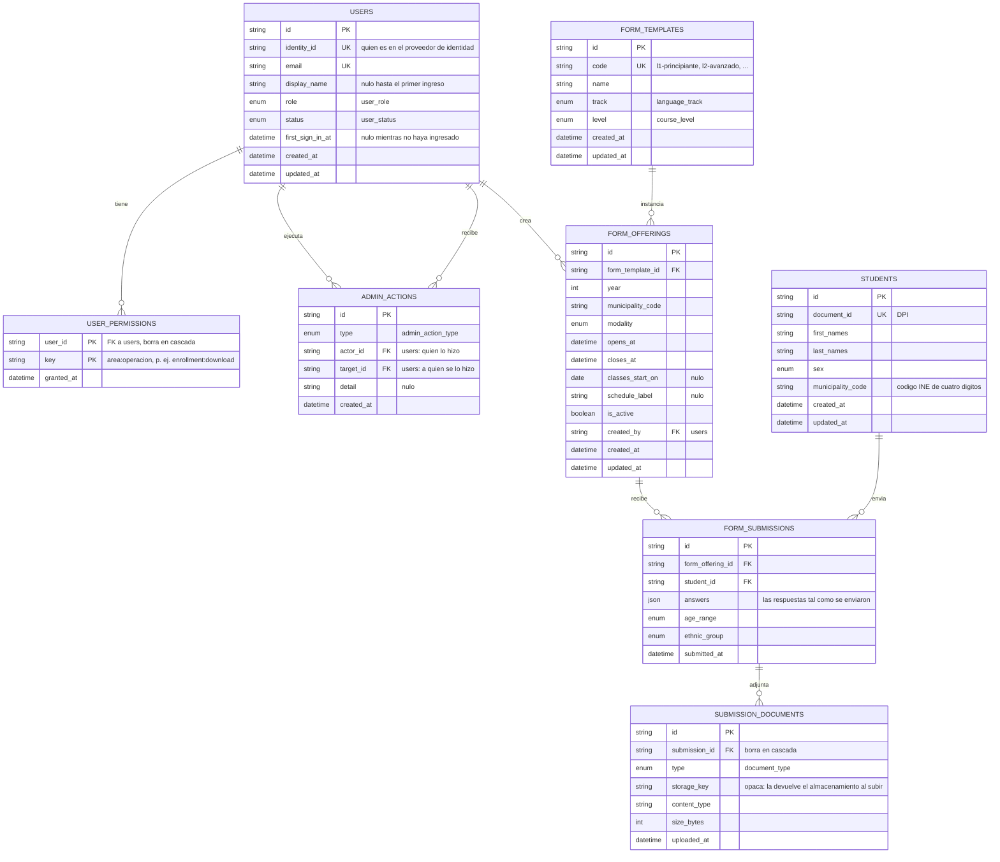

# Diagrama entidad-relación

Las ocho tablas que existen hoy en PostgreSQL, tal como las declara
[`prisma/schema.prisma`](../../prisma/schema.prisma). Los nombres del diagrama son los de la
base —tabla y columna en snake_case—, no los del modelo de Prisma, para que se pueda cotejar
contra una migración sin traducir nada.

Las claves primarias son `cuid` generadas por Prisma, no `uuid` de la base.

## Enums

Ninguno de estos catálogos es una tabla: su contenido es cerrado, lo conoce el código y nadie lo
administra desde la interfaz. Una fila nueva exige una migración, que es exactamente la
ceremonia que corresponde.

| Enum                | Valores                                                                                                            | Dónde se usa                    |
| ------------------- | ------------------------------------------------------------------------------------------------------------------ | ------------------------------- |
| `user_role`         | `ADMIN`, `MEMBER`                                                                                                  | `users.role`                    |
| `user_status`       | `ACTIVE`, `INACTIVE`                                                                                               | `users.status`                  |
| `admin_action_type` | `USER_CREATED`, `ROLE_CHANGED`, `PERMISSION_GRANTED`, `PERMISSION_REVOKED`, `USER_DEACTIVATED`, `USER_REACTIVATED` | `admin_actions.type`            |
| `language_track`    | `L1`, `L2`                                                                                                         | `form_templates.track`          |
| `course_level`      | `BEGINNER`, `INTERMEDIATE`, `ADVANCED`                                                                             | `form_templates.level`          |
| `modality`          | `VIRTUAL`, `IN_PERSON`                                                                                             | `form_offerings.modality`       |
| `sex`               | `FEMALE`, `MALE`                                                                                                   | `students.sex`                  |
| `age_range`         | `FROM_14_TO_30`, `FROM_31_TO_60`, `OVER_60`                                                                        | `form_submissions.age_range`    |
| `ethnic_group`      | `MAYA`, `GARIFUNA`, `XINKA`, `LADINO`, `OTHER`                                                                     | `form_submissions.ethnic_group` |
| `document_type`     | `IDENTITY_CARD`, `COMMITMENT_LETTER`, `ENROLLMENT_SHEET`, `BEGINNER_CERTIFICATE`, `INTERMEDIATE_CERTIFICATE`       | `submission_documents.type`     |

## Restricciones que sostienen una regla, no una optimización

| Restricción                                                       | Lo que impide                                                                                                                         |
| ----------------------------------------------------------------- | ------------------------------------------------------------------------------------------------------------------------------------- |
| `users.identity_id` único                                         | Dos perfiles para la misma identidad del proveedor.                                                                                   |
| `users.email` único                                               | Dos cuentas con el mismo correo.                                                                                                      |
| `students.document_id` único                                      | Duplicar el expediente de alguien: el DPI es lo que permite reutilizarlo entre convocatorias.                                         |
| `form_templates.code` único                                       | Que la fila deje de corresponder con la definición quemada en el código.                                                              |
| `form_offerings` único por (plantilla, año, municipio, modalidad) | Dos convocatorias idénticas compitiendo por las mismas inscripciones.                                                                 |
| `form_submissions` único por (convocatoria, estudiante)           | El segundo envío del mismo DPI a la misma convocatoria. Prisma devuelve `P2002` y el repositorio lo traduce a `AlreadyEnrolledError`. |
| `submission_documents` único por (inscripción, tipo)              | Dos copias del DPI en la misma inscripción.                                                                                           |

## Por qué el esquema es así

- **El rol es una columna, no una tabla.** No hay `roles` ni `role_permissions`: `users.role`
  distingue administración de miembro, y los permisos finos de un miembro son filas de
  `user_permissions` con una clave de texto `área:operación`. El catálogo de claves válidas vive
  en `src/modules/access/domain/modules.ts`. Una clave concedida sobre un área que ya no la
  ofrece queda guardada y no habilita nada; `scripts/check-orphans.ts` la reporta.
- **La modalidad pertenece a la convocatoria, no a la plantilla.** Por eso hay seis plantillas
  (L1/L2 × principiante, intermedio, avanzado) y el grupo virtual y el presencial de un mismo
  curso son dos convocatorias de la misma plantilla.
- **La convocatoria carga lo que se le muestra a quien se inscribe**: `classes_start_on` y
  `schedule_label`, además de la ventana `opens_at`/`closes_at`, interpretada en hora de
  Guatemala.
- **`answers` es el testimonio y es inmutable**: guarda las respuestas tal como se enviaron.
  `age_range` y `ethnic_group` repiten dos de ellas a propósito: son dimensiones del resumen
  anual y agrupar por columna es un `groupBy` normal, mientras que agrupar dentro del JSON exige
  consulta cruda. Se escriben en la misma operación que el JSON, así que no pueden divergir. El
  sexo y el municipio no se repiten aquí: ya viven en `students`.
- **El adjunto es hijo de la inscripción, con clave foránea real.** No es la relación polimórfica
  `owner_type`/`owner_id` del borrador: hoy el único dueño posible es una inscripción, y lo
  polimórfico renuncia a la integridad referencial a cambio de una flexibilidad que nadie usa.
  Cuando aparezca un segundo dueño se decide con el caso en la mano.
- **`storage_key` nunca llega al navegador.** El panel sirve el archivo por una ruta propia que
  autoriza antes de transmitirlo: una URL de blob es impredecible, pero pública.
- **El catálogo geográfico no está en la base.** Departamentos y municipios son una constante en
  `src/modules/geography/domain/guatemala.ts`. Quien ubica algo guarda el código INE del
  municipio (cuatro dígitos: los dos primeros son el departamento). La migración
  `20260831181500_remove_municipalieties_zone_department` es la que retiró esas tablas.

## Todavía no está en la base

La asignación a secciones —cursos, secciones, horarios y la matrícula que sale de una
inscripción aceptada— se dibujó en el borrador de este documento y no se ha migrado: ninguna
tabla la representa hoy. Vuelve al diagrama en el mismo commit que traiga su migración, no
antes.
