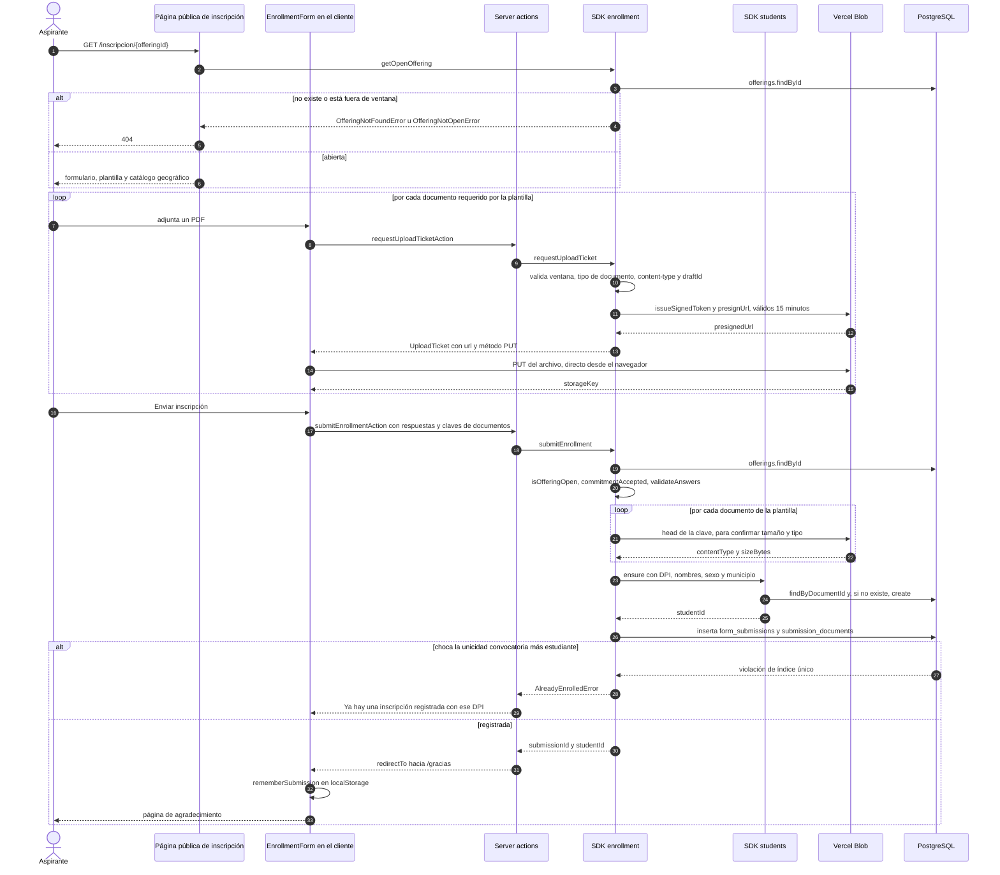
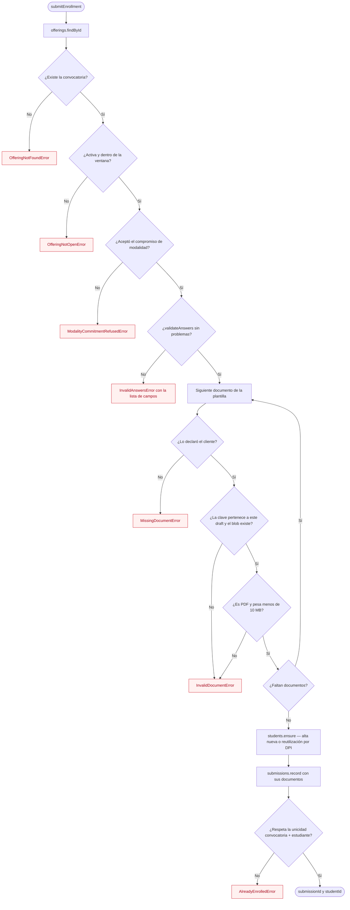
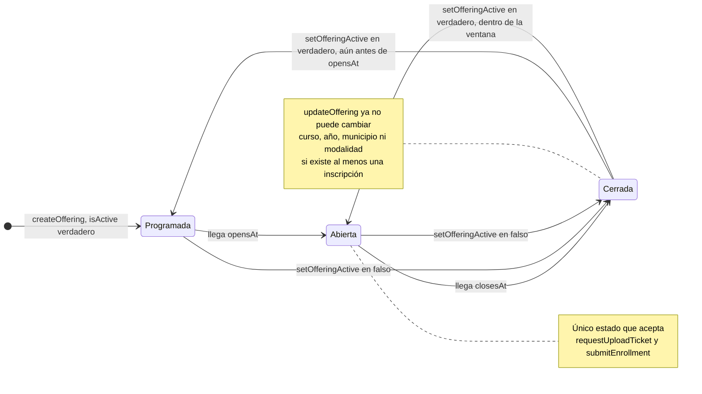
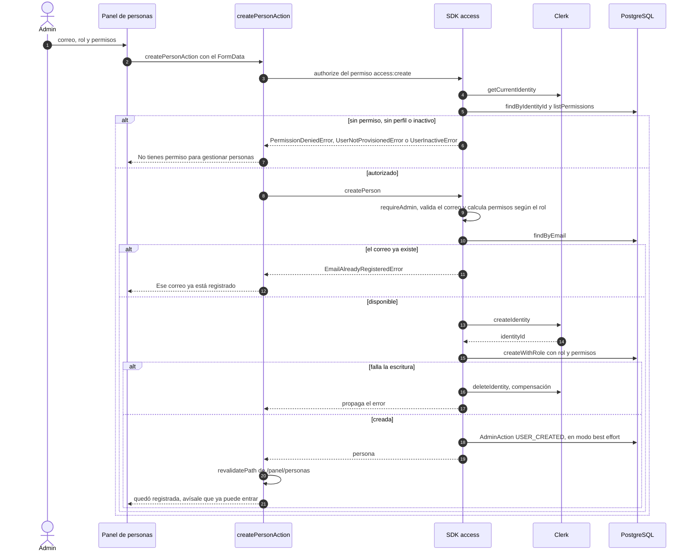
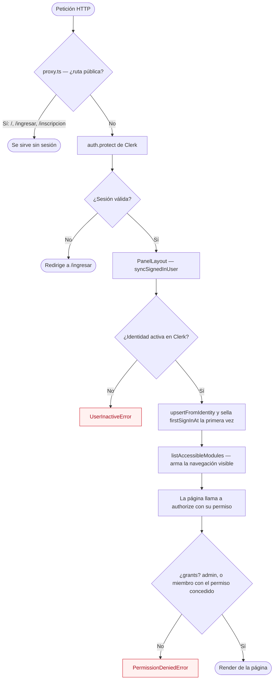

# Diagramas de proceso

UML no tiene un diagrama llamado «de proceso». Lo que se pide con ese nombre casi siempre es
uno de estos tres, y los tres salen de este repo porque los procesos están escritos como código
explícito —casos de uso puros en `src/modules/*/application/use-cases/`— y no repartidos entre
componentes:

| Diagrama UML                | Qué contesta                              | Mermaid            | Fidelidad |
| --------------------------- | ----------------------------------------- | ------------------ | --------- |
| Actividad                   | ¿Qué pasos y decisiones sigue el flujo?   | `flowchart`        | Aproximada: no hay notación nativa de _fork/join_ ni calles verticales |
| Secuencia                   | ¿Quién le habla a quién y en qué orden?   | `sequenceDiagram`  | Fiel      |
| Máquina de estados          | ¿En qué estados vive una entidad?         | `stateDiagram-v2`  | Fiel      |

Se renderizan solos en GitHub, en la vista previa de Markdown de VS Code y en IntelliJ.
El modelo de datos vive aparte, en [`docs/db/entidad-relacion.md`](../db/entidad-relacion.md).

---

## 1. Inscripción pública — secuencia

El proceso central: un aspirante llena el formulario de una convocatoria abierta y adjunta sus
PDF. Lo notable es que **el archivo nunca pasa por el servidor de la aplicación**: el caso de uso
firma un ticket temporal y el navegador sube directo al blob.

---

## 2. Reglas de `submitEnrollment` — actividad

El mismo proceso visto como cadena de guardas. Cada rombo es un `if` real del caso de uso
`src/modules/enrollment/application/use-cases/submit-enrollment.ts`; cada caja roja, un error de
dominio que la server action traduce a un mensaje en español.

---

## 3. Ciclo de vida de una convocatoria — máquina de estados

`OfferingStatus` **no se almacena**: `offeringStatus()` lo deriva en cada lectura a partir de
`opensAt`, `closesAt` y del único campo persistido, `isActive`. Por eso hay transiciones que
ocurren solas, con el paso del tiempo, y otras que alguien dispara desde el panel.

---

## 4. Alta de una persona en el panel — secuencia

Interesa porque cruza dos sistemas —Clerk y la base propia— y tiene **compensación**: si la
escritura en PostgreSQL falla después de haber creado la identidad, esa identidad se borra.

---

## 5. Entrada al panel y autorización — actividad

Tres controles encadenados: la frontera de red (`src/proxy.ts`), la sincronización de perfil del
layout y el permiso puntual que pide cada página o server action.

Los permisos concretos que exige cada ruta están en las llamadas a `access.authorize` de
`src/app/panel/`: `students:read`, `access:read`, `access:create`, `access:update`,
`access:delete`, `enrollment:read`, `enrollment:create` y `enrollment:update`.
